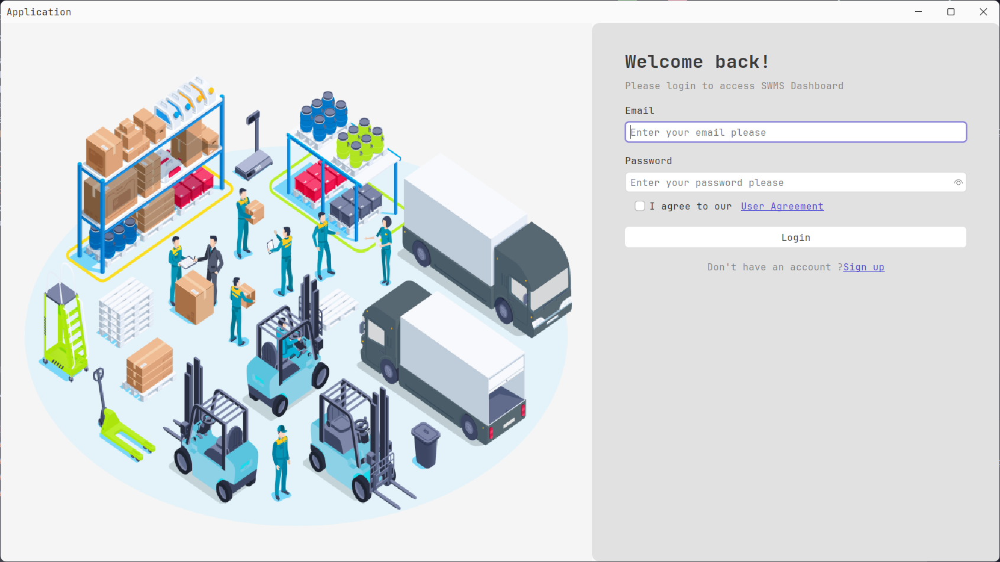
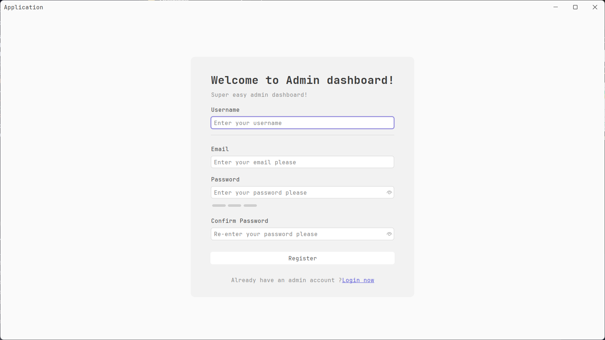
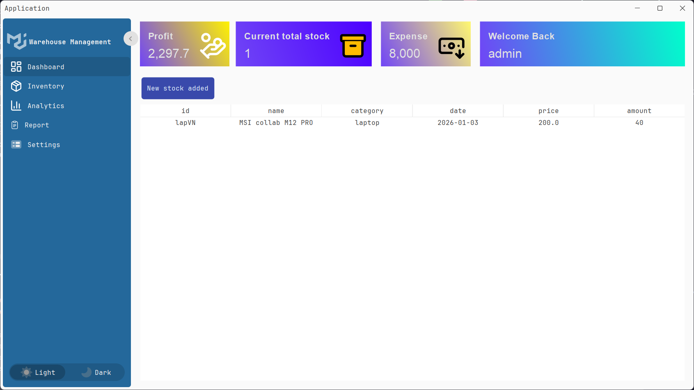
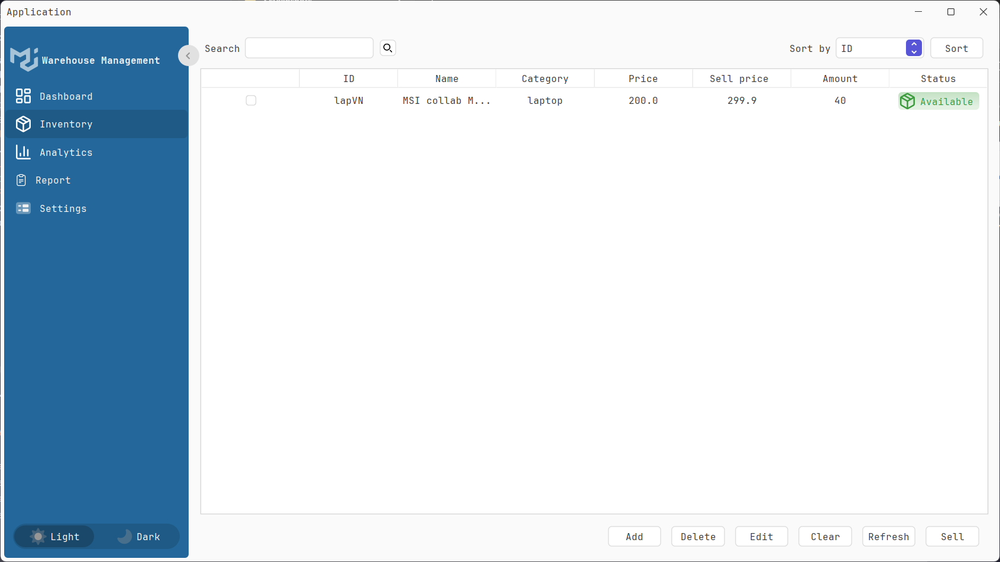
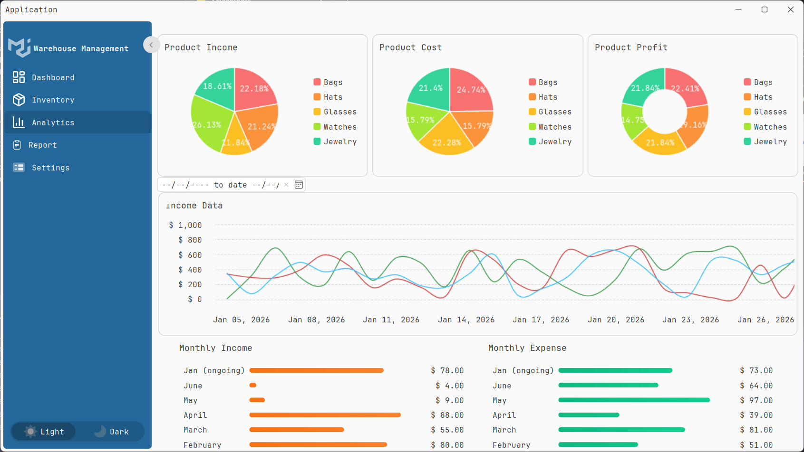
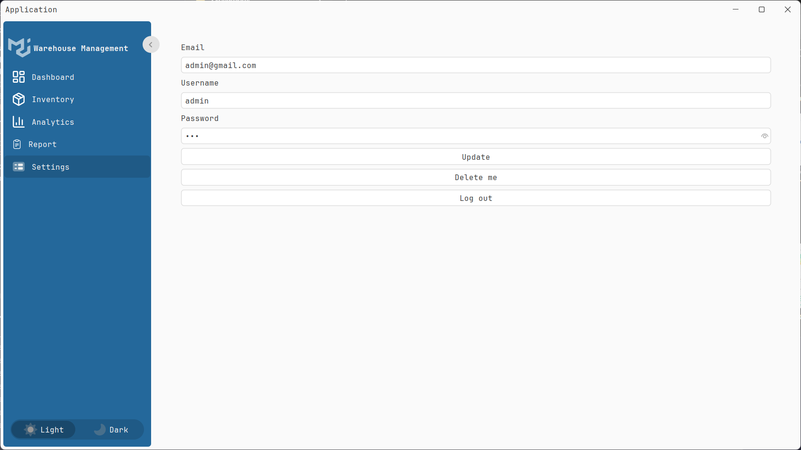

<h1 align="center">
   WareHouse Manager application
  <br>
</h1>

<p align="center">
  <b>Open-source  WareHouse Manager application</b> <br />
  <b>Easy to use • Less installation.</b> <br />
</p>

<h4 align="center">
  <a href="./LICENSE">
    
  </a>
  <a href="https://github.com/MinhCreator/manager-app/blob/main/CONTRIBUTING.md">
    
  </a>
</h4>

# Manager Application

A modern Java-based management application with a sleek user interface for managing various business operations.

## Features

- **User Authentication**: Secure login and signup system
- **Dashboard**: Overview of key metrics and analytics
- **Inventory Management**: Track and manage warehouse inventory
- **Reporting**: Generate and view various business reports
- **Responsive UI**: Modern and intuitive user interface
- **Light/Dark Mode**: Toggle between light and dark themes

## Screenshots

<p align="center">

  
  
  
  
  
  
</p>

## Technologies Used

- **Java**: Core application logic
- **Swing**: For the graphical user interface
- **FlatLaf**: Modern Look and Feel for Java Swing
- **MySQL**: Database management
- **Maven**: Dependency management

## Prerequisites

- Java JDK 11 or higher
- Maven 3.8.1 or higher
- MySQL Server 8.0 or higher

## Installation

1. Clone the repository:
   ```bash
   git clone https://github.com/MinhCreator/manager-app.git
   cd manager-app
   ```

2. Configure the database:
    - Create a new MySQL database
    - Update the database configuration in `src/main/resources/application.properties`

3. Build the project:
   ```bash
   mvn clean install
   ```

4. Run the application:
   ```bash
   mvn exec:java -Dexec.mainClass="minhcreator.main.Application"
   ```

## Project Structure

```
src/main/java/minhcreator/
├── component/           # UI Components
│   ├── form/           # Form components
│   ├── menu/           # Menu components
│   └── UIManager/      # UI Management
├── functional/         # Core functionality
├── service/            # Business logic services
└── util/               # Utility classes
```

## Contributing

1. Fork the repository
2. Create your feature branch (`git checkout -b feature/AmazingFeature`)
3. Commit your changes (`git commit -m 'Add some AmazingFeature'`)
4. Push to the branch (`git push origin feature/AmazingFeature`)
5. Open a Pull Request

## License

This project is licensed under the MIT License - see the [LICENSE](LICENSE) file for details.

## Support

For support, please open an issue in the GitHub repository.