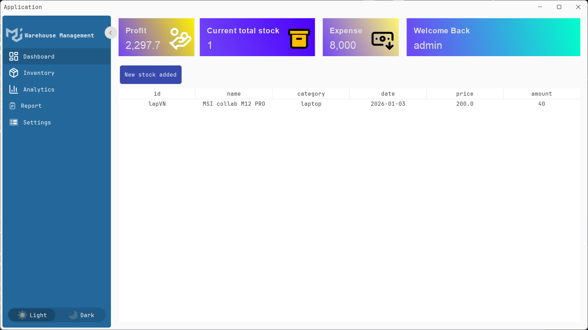
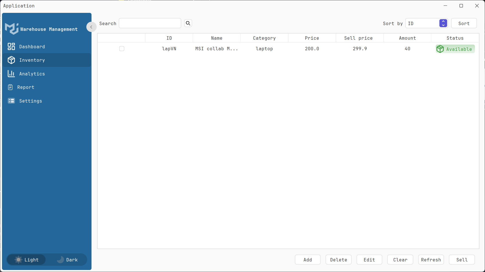
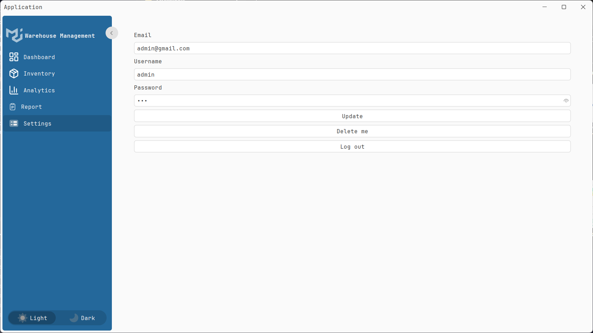

<h1 align="center">Warehouse Manager</h1>

<p align="center">
  <b>Open-source warehouse & business management desktop application</b><br>
  <b>Java Swing • FlatLaf • Hibernate • MySQL</b>
</p>

<p align="center">
  <a href="./LICENSE"></a>
  <a href="./CONTRIBUTING.md"></a>
</p>

---

## Features

- **User Authentication** — Secure login/signup with BCrypt password hashing
- **Dashboard** — Overview of profit, expenses, stock levels with real-time cards
- **Inventory Management** — Add, edit, delete products with stock tracking
- **Invoice System** — Create invoices, print PDF with Vietnamese font support
- **Analytics** — Pie charts (income/cost/profit), line charts (financial trends), date-range filtering
- **Shopping Cart** — Multi-item checkout with stock validation
- **Light/Dark Mode** — Theme toggle with accent color picker
- **Log Viewer** — Real-time application event log with level filtering
- **Configuration GUI** — Edit database connection & app settings from UI
- **PDF Export** — Generate invoices with iTextPDF

## Screenshots

<p align="center">
  
  
  
  
  
  
</p>

## Technology Stack

| Component | Technology |
|---|---|
| Language | Java 21+ |
| UI Framework | Java Swing + FlatLaf 3.7 |
| Build Tool | Maven |
| Database | MySQL 8.0+ |
| ORM | Hibernate 6.6 (JPA 3.1) |
| Connection Pool | C3P0 |
| Charts | swing-chart |
| PDF | iTextPDF 5.5 |
| Password Hashing | BCrypt (at.favre.lib) |
| SVG Icons | FlatSVGIcon (jsvg) |
| Layout | MiGLayout |

## Quick Start

### Prerequisites

- JDK 21 or later
- Maven 3.8+
- MySQL 8.0+

### Setup

1. **Clone the repository**
   ```bash
   git clone https://github.com/MinhCreator/manager-app.git
   cd manager-app
   ```

2. **Create the database**
   ```bash
   mysql -u root -p < schema/db.sql
   ```

3. **Configure database connection**  
   Edit `src/main/resources/minhcreator/config/appConfig.properties`:
   ```properties
   db.url=jdbc:mysql://localhost/warehouse
   db.user=root
   db.password=your_password
   ```

4. **Build and run**
   ```bash
   mvn clean compile
   mvn exec:java -Dexec.mainClass="minhcreator.main.Application"
   ```

### Build a Runnable JAR
```bash
mvn assembly:single
java -jar target/manager_app-1.0-SNAPSHOT-jar-with-dependencies.jar
```

## Project Structure

```
src/main/java/minhcreator/
├── main/Application.java          -- Entry point
├── component/                     -- UI components
│   ├── page/                      -- Screens (Login, Dashboard, etc.)
│   ├── ModularPanel/              -- Panel implementations
│   ├── menu/                      -- Navigation menu system
│   └── ...                        -- Shared widgets
├── service/                       -- Business logic layer
├── entity/                        -- JPA entities
├── functional/
│   ├── database/                  -- HibernateUtil, DAOs
│   └── session/                   -- Session management
└── util/                          -- Utilities, logger, config
```

## Configuration

All application settings are in `appConfig.properties`:
- Database connection (URL, user, password)
- Window dimensions and title
- Can be edited via **Settings → Configuration** in-app

## Documentation

- [User Guide](./instruction.md) — How to use the application
- [Developer Docs](./documentation.md) — Architecture, API, contribution guide

## License

This project is licensed under the MIT License — see [LICENSE](LICENSE).

## Authors

- **Raven** — Original menu system, chart integration
- **MinhCreatorVN** — Application logic, Hibernate migration, UI customization
