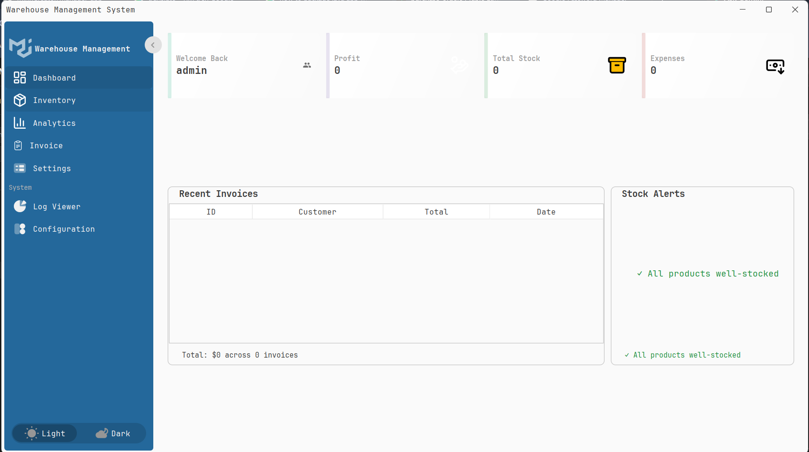
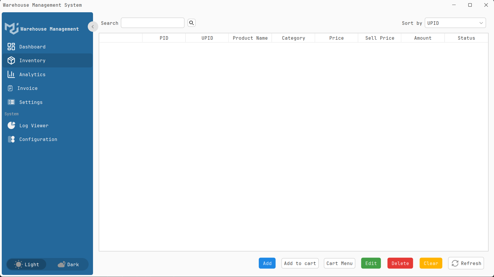
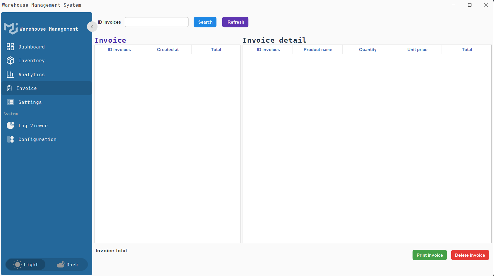
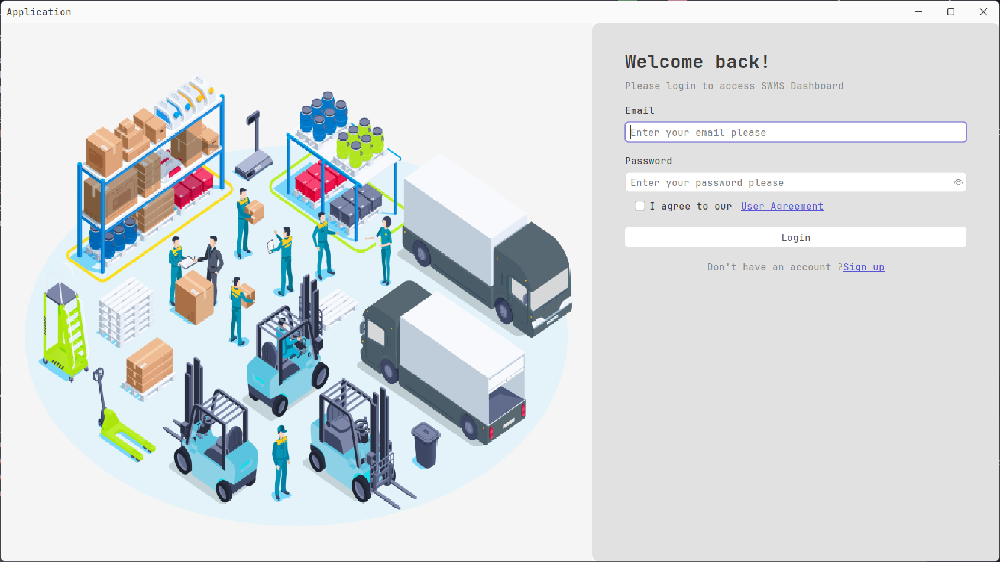
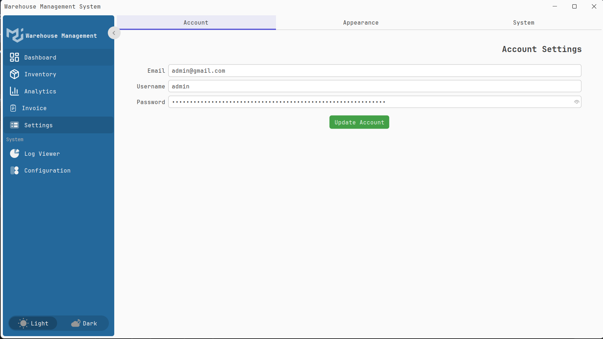
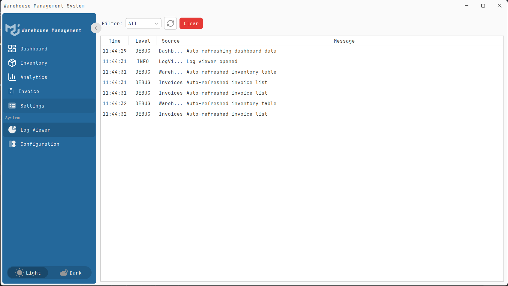
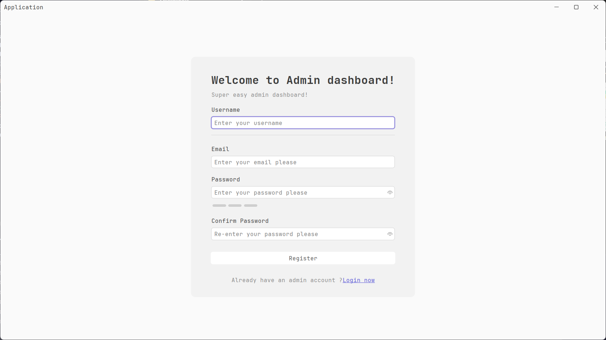
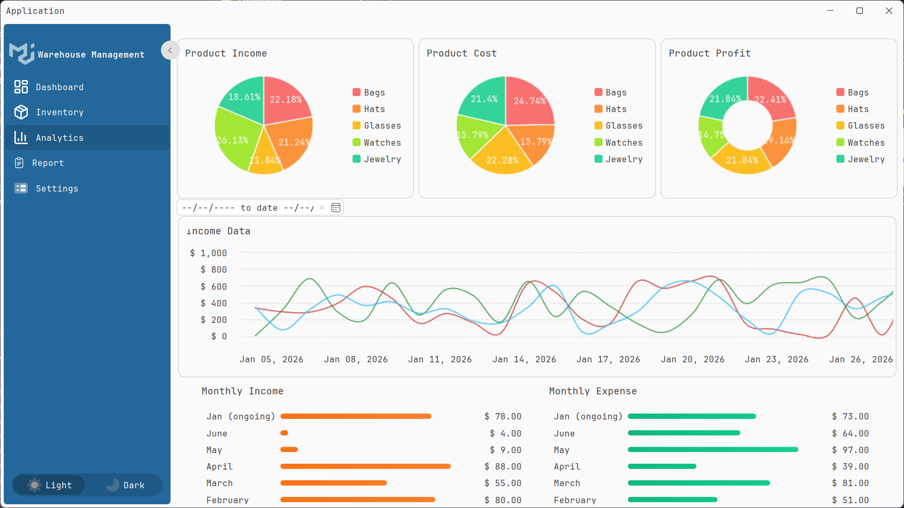

<h1 align="center">Warehouse Manager</h1>

<p align="center">
  <b>Open-source warehouse & business management desktop application</b><br>
  <b>Java 25 • Swing + FlatLaf 3.7 • Hibernate 6.6 • PostgreSQL (Supabase)</b>
</p>

<p align="center">
  <a href="./LICENSE"></a>
  <a href="./CONTRIBUTING.md"></a>
  
  
</p>

---

## Features

- **User Authentication** — Secure login/signup with BCrypt password hashing
- **Dashboard** — Overview of profit, expenses, stock levels with real-time cards
- **Inventory Management** — Add, edit, delete, search, sort products with stock IN/OUT tracking
- **Invoice System** — Create invoices, view details, export PDF with Vietnamese font support
- **Analytics** — Pie charts (income/cost/profit by category), line charts (financial trends), date-range filtering
- **Shopping Cart** — Multi-item checkout with stock validation, auto-creates invoices
- **Light/Dark Mode** — 4 themes (Material You & macOS), accent color picker, light/dark toggle
- **Log Viewer** — Real-time application event log with INFO/WARNING/ERROR/DEBUG filtering
- **Configuration GUI** — Edit database connection & app settings from within the UI
- **Account Management** — Update profile, change password, delete account

## Screenshots

| Dashboard | Inventory |
|:---:|:---:|
|  |  |

| Invoice | Analytics |
|:---:|:---:|
|  |  |

| Settings | Log Viewer |
|:---:|:---:|
|  |  |

| Login | More screens |
|:---:|:---:|
|  |  |

Additional screenshots: [`preview/3.png`](./preview/3.png), [`preview/4.png`](./preview/4.png), [`preview/6.png`](./preview/6.png).

## Technology Stack

| Category             | Technology                                   |
| -------------------- | -------------------------------------------- |
| Language             | Java 25 (source/target 25)                   |
| UI Framework         | Java Swing + FlatLaf 3.7                     |
| Build Tool           | Maven (19 dependencies)                      |
| Database             | PostgreSQL 14+ (Supabase) / MySQL (legacy)   |
| ORM                  | Hibernate 6.6.0.Final (JPA 3.1 / Jakarta)   |
| Connection Pool      | C3P0 (Hibernate)                             |
| Charts               | swing-chart (custom local JAR)               |
| PDF                  | iTextPDF 5.5.13.3                            |
| Password Hashing     | BCrypt (at.favre.lib) 0.10.2                 |
| SVG Icons            | FlatSVGIcon (jsvg 2.0.0) — 45+ icons        |
| Layout               | MiGLayout 11.4.2, AbsoluteLayout             |
| Date Picker          | swing-datetime-picker 2.1.3                  |
| Modal Dialog         | modal-dialog 2.5.2                           |
| Animations           | TimingFramework 0.55                         |
| Notifications        | swing-toast-notifications 1.0.4              |
| Font                 | JetBrains Mono (FlatLaf bundle)              |

### Theme System — 4 themes, 2 families

| Theme | Type | Accent |
|-------|------|--------|
| `material_light` (default) | Material You Light | #6750A4 (purple) |
| `material_dark` | Material You Dark | #D0BCFF (light purple) |
| `mac_light` | macOS Aqua-like Light | #2675BF (blue) |
| `mac_dark` | macOS Aqua-like Dark | #4B6EAF (blue) |

Toggle themes via the sidebar light/dark widget or the accent color picker in the menu footer.

## Quick Start

### Prerequisites

- JDK 25 (21+ compatible)
- Maven 3.8+
- PostgreSQL 14+ (or a Supabase project)

### Setup

1. **Clone the repository**

   ```bash
   git clone https://github.com/MinhCreator/manager-app.git
   cd manager-app
   ```

2. **Create the database**

   ```bash
   psql -U postgres -d postgres < schema/supabase.sql
   ```

   This creates 7 tables: `users`, `products`, `inventory`, `purchase_orders`, `sales_orders`, `invoices`, `invoice_details` — all with foreign keys and indexes.

3. **Configure database connection**

   Copy and edit `src/main/resources/minhcreator/config/appConfig.properties`:

   ```properties
   db.url=jdbc:postgresql://<host>:5432/postgres?sslmode=require
   db.user=postgres
   db.password=YOUR_SUPABASE_DB_PASSWORD
   ```

4. **Build and run**

   ```bash
   mvn clean compile
   mvn exec:java -Dexec.mainClass="minhcreator.main.Application"
   ```

   > **Note:** `exec-maven-plugin` and `maven-assembly-plugin` are not declared in `pom.xml`. If the commands above don't work, add them to `<plugins>` or run the application directly from your IDE via `minhcreator.main.Application`.

### Build a Runnable JAR

Add the maven-assembly-plugin to `pom.xml` first, then:

```bash
mvn clean package assembly:single
java -jar target/manager_app-1.0-SNAPSHOT-jar-with-dependencies.jar
```

## Project Structure

```
src/main/java/minhcreator/
├── main/
│   └── Application.java              -- Entry point (JFrame)
├── component/                         -- UI components
│   ├── page/                          -- Screens (Login, Dashboard, etc.)
│   ├── ModularPanel/                  -- Panel implementations (Dash, Warehouse, Analytics, etc.)
│   ├── menu/                          -- Animated sidebar menu system
│   │   └── mode/                      -- Light/dark toggle & accent color picker
│   ├── form/                          -- Base form containers (MainForm, SimpleForm)
│   ├── model/                         -- UI data models (Product, ModelCard)
│   ├── stock/                         -- Stock status enum & table badge renderer
│   ├── Security/                      -- Input validation helpers
│   └── ...                            -- Shared widgets (Card, Dialog, PopUp, RoundPanel)
├── service/                           -- Business logic layer
│   ├── WarehouseService.java          -- Inventory CRUD & analytics aggregation
│   ├── orderService.java              -- Cart/checkout logic
│   └── orderPanel.java                -- Cart UI dialog
├── entity/                            -- JPA entities (7 entities, user_id FK pattern)
├── functional/
│   ├── database/                      -- HibernateUtil, DAOs (6 DAOs)
│   │   └── dao/                       -- Per-entity DAO classes
│   └── session/                       -- Session management (in-memory auth)
└── util/                              -- Utilities
    ├── AppLogger.java                 -- Ring-buffer logger (1000 entries, 4 levels)
    ├── ThemeManager.java              -- Theme switching logic
    ├── MethodUtil.java                -- Password strength checker
    └── ...                            -- Config loader, font manager, image renderer

src/main/resources/
├── hibernate.cfg.xml                  -- Hibernate config
├── minhcreator/
│   ├── config/appConfig.properties    -- DB, window & theme settings
│   ├── themes/                        -- 5 FlatLaf .properties files
│   ├── colorPalette/color.txt         -- 30 chart colors
│   └── assets/                        -- 45+ SVG icons + brand images
└── ...                                -- Additional icon categories
```

## Architecture

```
  ┌─────────────┐
  │  Swing UI   │  Pages (Login, Dashboard, Inventory, Analytics ...)
  │  (Panel)    │  + ModularPanel implementations + shared widgets
  ├─────────────┤
  │  Service    │  WarehouseService, orderService
  │  (Business) │
  ├─────────────┤
  │  DAO        │  UserDAO, ProductDAO, InventoryDAO, InvoiceDAO ...
  │  (Persistence)│
  ├─────────────┤
  │  Hibernate  │  SessionFactory, JPA entities, C3P0 pool
  ├─────────────┤
  │  PostgreSQL │  Supabase-hosted, auto-DDL via hbm2ddl
  └─────────────┘
```

All flows cross every layer. Cross-cutting: `ThemeManager`, `AppLogger`, `SessionManager`, `HibernateUtil`.

## Entity Model

All 7 JPA entities share a `user_id` foreign key pattern, scoping every record to a single user:

| Entity | Table | Key Fields |
|--------|-------|------------|
| `UserEntity` | `users` | `id` (PK), `username`, `email`, `password` (BCrypt) |
| `ProductEntity` | `products` | `id` (PK), `user_id` (FK), `UPID`, `name` |
| `InventoryEntity` | `inventory` | `product_id` (PK/FK), `user_id`, `category`, `price`, `selling_price`, `quantity` |
| `PurchaseOrderEntity` | `purchase_orders` | `id` (PK), `user_id`, `product_id`, `quantity`, `import_price`, `date` |
| `SalesOrderEntity` | `sales_orders` | `id` (PK), `user_id`, `product_id`, `quantity`, `selling_price`, `date` |
| `InvoiceEntity` | `invoices` | `invoice_id` (PK), `user_id`, `customer_name`, `total_amount`, `created_at` |
| `InvoiceDetailEntity` | `invoice_details` | `detail_id` (PK), `user_id`, `invoice_id`, `product_id`, `quantity`, `unit_price` |

## Navigation

| # | Label | Panel Class | Description |
|---|-------|-------------|-------------|
| 0 | Dashboard | `DashPanel.java` | Overview cards, recent stock feed |
| 1 | Inventory | `WarehousePanel.java` | Product CRUD, stock IN/OUT, search, sort |
| 2 | Analytics | `AnalyticsPanel.java` | Pie/line charts, date-range filter |
| 3 | Invoice | `invoicesPanel.java` | Invoice viewer, PDF export |
| 4 | Settings | `settings.java` | Profile, password, theme, logout |
| 5 | Log Viewer | `LogViewerPanel.java` | Real-time log, 4-level filter |
| 6 | Configuration | `ConfigPanel.java` | DB & window config editor |

## Configuration

All application settings in `src/main/resources/minhcreator/config/appConfig.properties`:

- Database connection (URL, user, password)
- Window dimensions (1366×768 default), title, location, resizability
- Theme selection (`material_light` / `material_dark`)
- Editable via **Settings → Configuration** in-app

## SVG Icon Library

The project bundles 45+ SVG icons under `src/main/resources/minhcreator/assets/`:

| Category | Count | Examples |
|----------|-------|---------|
| Menu icons | 9 | Dashboard, Inventory, Analytics, Invoice, Settings, Logs, Config |
| Functional icons | ~21 | search, refresh, add, delete, profit, expense, stock, credit, print |
| Debug icons | 4 | Info, Error, Success, Warning |
| Mode icons | 2 | Light, Dark |
| Export icons | 2 | Dropdown menu, Hidden |
| Brand | 3+ | Logo, warehouse illustrations |

## Documentation

- [User Guide](./instruction.md) — How to use the application
- [Developer Docs](./documentation.md) — Architecture, API, extension guide
- [Schema](./schema/) — SQL scripts (PostgreSQL/Supabase + MySQL legacy)
- [Project Visualization](./project-visualization.html) — Interactive HTML architecture overview (open in browser)
- [Contributing](./CONTRIBUTING.md) — PR and issue guidelines

## License

This project is licensed under the MIT License — see [LICENSE](./LICENSE).

## Authors

- **Raven** — Original menu system, chart integration (DJ-Raven)
- **MinhCreatorVN** — Application logic, Hibernate migration, UI customization
